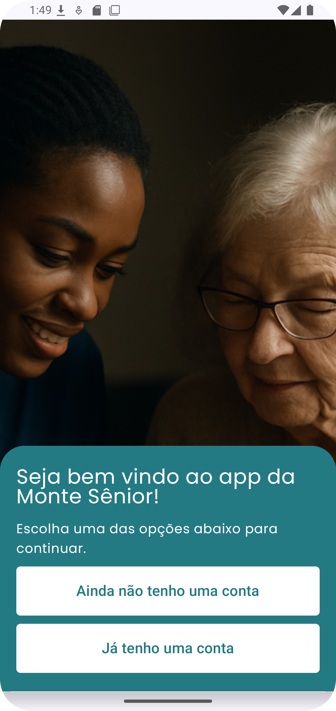

Monte Sênior - Cursos para Cuidadores de Idosos

Aplicativo oficial da Monte Sênior, desenvolvido para capacitar profissionais e iniciantes na área de cuidados geriátricos através de cursos certificados.

  

  
  
  

Sobre o Projeto

Objetivo: Oferecer capacitação prática e acessível para cuidadores de idosos.

Público-alvo: Profissionais já atuantes e novos ingressantes na área.

Status: Em desenvolvimento.

Tecnologias Utilizadas

Linguagem: Kotlin

Interface: Jetpack Compose (Android)

Ferramenta: Android Studio

Recursos do App

Catálogo de cursos organizados por temas.

Emissão de certificados digitais.

Acompanhamento de progresso do usuário.

Como Visualizar o Projeto

Clone o repositório:

bash
git clone https://github.com/renzoluigi/monte-senior-app.git

Abra o projeto no Android Studio.

Execute no emulador ou dispositivo Android (API 27+).
